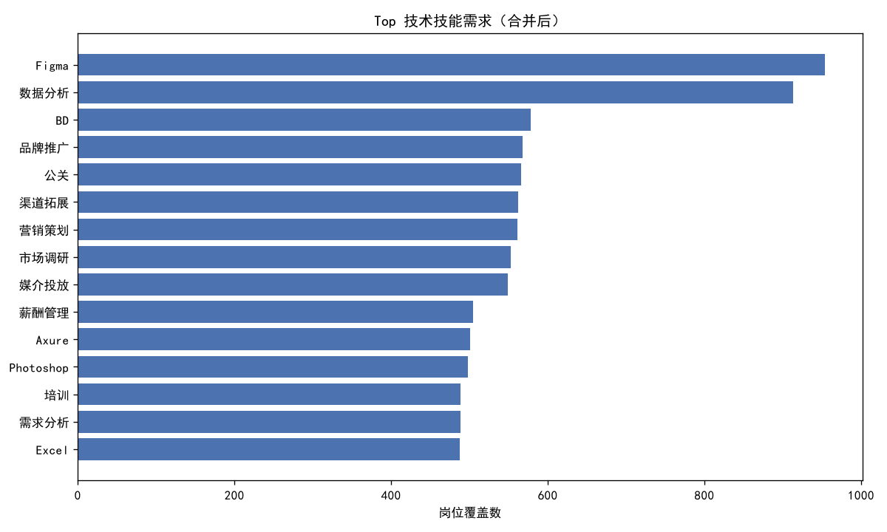
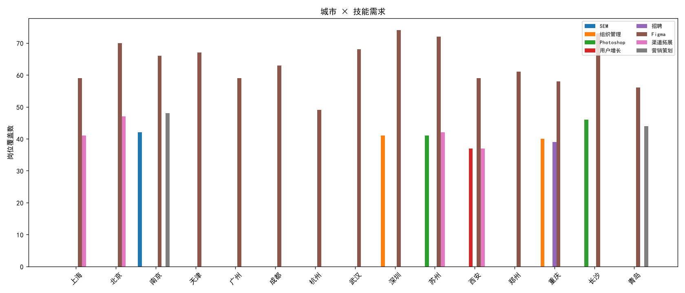
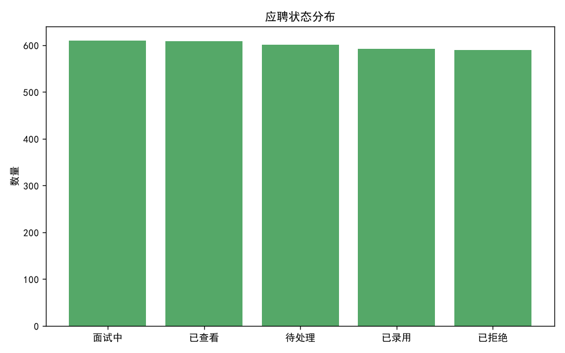

# 招聘信息智能分析流水线

从非结构化的招聘 JD 文本中，用 LLM 提取结构化信息（技术技能 / 软技能 / 经验年限 / 学历），完成清洗、提取、入库、多维分析与可视化，并提供 Streamlit 交互式仪表盘与每日定时自动化。

- **技术栈**：Python 3.10+ · DeepSeek API（OpenAI 兼容）· Pandas · SQLite · Matplotlib · WordCloud · Streamlit · schedule
- **数据规模**：岗位 5000 条 / 求职者 1000 条 / 应聘记录 3000 条（三表关联）
- **验证环境**：Windows + Python 3.13.5（pip + venv 虚拟环境）

> **声明**：本项目为个人学习练习项目，部分代码由 AI 辅助生成，本人完成需求设计、代码审阅、调试与功能验证，仅用于学习，严禁用于未授权测试。

## 核心亮点

| 亮点 | 说明 |
|---|---|
| `safe_parse_json()` 四级降级解析 | LLM 输出格式不稳定时（Markdown 包裹、夹杂解释文字等）逐级降级尝试解析，最终兜底返回空结构并记录日志，**保证流水线不中断** |
| 技能统计用 `set()` 去重 | 统计的是"岗位覆盖数"（多少个岗位要求该技能）而非词频，避免单条 JD 重复提及导致的虚高 |
| 关闭思考模式 | `extra_body={"thinking": {"type": "disabled"}}`，加速生成并显著降低 token 成本 |
| 只提取显式陈述内容 | SYSTEM_PROMPT 严禁按岗位名称"推测"技能，保证提取结果可溯源到 JD 原文 |
| 技能归一化合并 | LLM 提取结果与原始 `skills` 标签去重合并为 `skills_merged`，同时保留两份独立字段便于对比 |

## 流水线架构

```
data/jobs.csv ──┐
data/candidates.csv ──┤ ① load_data.py   清洗文本、生成 combined_text
data/applications.csv ──┘        │
                        data/raw_jobs.csv
                                 │ ② extract_llm.py  LLM 结构化提取（核心）
                                 │   └ safe_parse_json 四级降级
                        data/structured_jobs.csv
                                 │ ③ analyze.py      写入 SQLite + 六维分析
                    ┌────────────┼────────────┐
              data/jobs.db   控制台分析报告    │ ④ visualize.py → 4 张 PNG
                                             │ ⑤ pipeline.py     串联①-④ + 每日简报
                                             └ app.py            Streamlit 仪表盘
```

 
 

①–④ 为顺序依赖：**必须按 load → extract → analyze → visualize 的顺序执行**，`pipeline.py` 会自动串起整条流水线。

## 快速开始

```bat
git clone https://github.com/vgg676/job-market-pipeline.git
cd job-market-pipeline
python -m venv .venv
:: 激活虚拟环境（Windows）
.venv\Scripts\activate
pip install -r requirements.txt
:: 复制配置模板，再在其中填入 DEEPSEEK_API_KEY
copy .env.example .env
:: 放置数据：将三张原始 CSV 放入 data/（无原始数据也可先用 data/sample/ 下的脱敏样例试跑）
python load_data.py
python extract_llm.py
python analyze.py
python visualize.py
streamlit run app.py
```

> **macOS / Linux 用户**：激活虚拟环境请用 `source .venv/bin/activate`；复制配置模板请用 `cp .env.example .env`；其余命令（clone / venv 创建 / pip install / python *.py / streamlit run）与上方完全相同。

> **无原始数据 / 无 API Key 也能跑通全链路（跳过 LLM）**：把 `data/sample/` 下的四个文件复制到 `data/` 并去掉 `_sample` 后缀（即 `jobs.csv`、`candidates.csv`、`applications.csv`、`structured_jobs.csv`；其中 `candidates.csv` 的姓名已脱敏为 `求职者001` 等编号），然后执行：
> ```bat
> python analyze.py
> :: step3
> python visualize.py
> :: step4
> streamlit run app.py
> :: 仪表盘
> ```
> 这样即可跳过 step1/step2（两者都需要原始全量数据 / API Key）。

## 环境要求

- Python **3.10+**（在 3.13.5 上验证通过）
- Windows 系统（词云字体默认使用 `C:\Windows\Fonts\simhei.ttf`；macOS/Linux 见 [FAQ](#常见问题-faq)）
- DeepSeek API Key（或 OpenAI Key，二选一）

## 安装步骤

### 1. 获取代码并进入目录

```bat
cd job-market-pipeline
```

### 2. 创建虚拟环境

任选其一：

```bat
:: 方式 A：标准 venv（推荐，本项目实际使用）
python -m venv .venv
.venv\Scripts\activate

:: 方式 B：uv（可选，更快）
uv venv
.venv\Scripts\activate
```

### 3. 安装依赖

```bat
pip install -r requirements.txt
```

国内网络加速：

```bat
pip install -r requirements.txt -i https://pypi.tuna.tsinghua.edu.cn/simple
```

### 4. 配置 API Key

Key 通过环境变量注入，**代码仓库中不保存任何密钥**。

**方式 A（推荐，PyCharm 用户）**：Run → Edit Configurations → Environment variables，添加：

| Name | Value |
|---|---|
| `DEEPSEEK_API_KEY` | `sk-你的真实key` |

> ⚠️ PyCharm 的 Terminal **不会**加载运行配置里的环境变量。在 Terminal 手动跑脚本前需先 `set DEEPSEEK_API_KEY=xxx`（CMD）或 `$env:DEEPSEEK_API_KEY="xxx"`（PowerShell），否则报 `401 Unauthorized`。

**方式 B（命令行临时注入）**：

```powershell
# PowerShell（仅当前会话有效）
$env:DEEPSEEK_API_KEY = "sk-你的真实key"
```

```bat
:: CMD（仅当前会话有效）
set DEEPSEEK_API_KEY=sk-你的真实key
```

### 5. 准备数据

将三个数据文件放入 `data/` 目录（首次使用需手动放置）：

```
data/jobs.csv            # 岗位数据（5000 条）
data/candidates.csv      # 求职者数据（1000 条）
data/applications.csv    # 应聘数据（3000 条）
```

## 使用方法

### 1. 手动执行流水线（按顺序）

```bat
python load_data.py
:: step1：加载三表 + 清洗 + 生成 combined_text
python extract_llm.py
:: step2：LLM 结构化提取（5000 条，约 1-2 小时）
python analyze.py
:: step3：写入 SQLite + 多维分析，控制台输出报告
python visualize.py
:: step4：生成 4 张图表 PNG
```

step2 的正常输出示例：

```
[step2] (1/5000) Java开发工程师 | 原技能:TensorFlow,Linux,Python | LLM补充:['TensorFlow', 'Linux', 'Python']
[step2] (5/5000) 后端开发工程师 | 原技能:大数据,Hadoop,Scikit-learn,Git,Re | LLM补充:['大数据', 'Hadoop', 'Scikit-learn', 'Git', 'React', 'MySQL']
```

- `原技能`：数据集自带的 skills 标签（截断显示前 30 字符）
- `LLM补充`：LLM 从 JD 描述文本中独立提取的技能
- 最终 `skills_merged` = 原技能 + LLM 技能，去重合并

### 2. 自动化定时（可选）

```bat
python pipeline.py
:: 立即完整跑一次，之后每天 08:00 自动执行；Ctrl+C 退出
```

每次运行会额外生成当日简报 `data/report_YYYYMMDD.md`。

### 3. 启动 Streamlit 仪表盘

```bat
streamlit run app.py
```

> **必须**用 `streamlit run` 启动，不能用 `python app.py`（会报 `missing ScriptRunContext!`，页面打不开）。

浏览器访问 <http://localhost:8501>，支持按岗位类别 / 城市 / 公司规模 / 应聘状态筛选，查看 Top 技能、多维分布与原始数据。

### 4. 输出产物一览

| 文件 | 产生步骤 | 说明 |
|---|---|---|
| `data/raw_jobs.csv` | step1 | 清洗后岗位（含 `combined_text`） |
| `data/structured_jobs.csv` | step2 | LLM 提取后的结构化岗位（含 `skills_merged`） |
| `data/jobs.db` | step3 | SQLite，含 `jobs` / `candidates` / `applications` 三张表 |
| `data/top_skills.png` | step4 | Top 技术技能横向柱状图 |
| `data/skill_cloud.png` | step4 | 技能词云 |
| `data/city_skills.png` | step4 | 城市 × 技能堆叠柱状图 |
| `data/apply_status.png` | step4 | 应聘状态分布 |
| `data/report_YYYYMMDD.md` | step5 | 每日趋势简报 |

## 数据来源与合规声明

- **数据来源**：本项目的岗位 / 求职者 / 应聘三表来自公开的天池招聘数据集（阿里云天池），仅用于学习与研究，不代表任何真实个人。
- **合规说明**：原始数据文件（含 `candidates.csv` 中的姓名、年龄、性别等个人属性字段）**不纳入版本控制**，已被 `.gitignore` 排除；仓库仅提供 `data/sample/` 下的**脱敏样例**（求职者姓名已替换为 `求职者001` 等编号，`self_introduction` 中的姓名同步替换）。
- **使用约束**：请勿将本数据集用于商业用途或任何侵犯个人隐私的场景。

## 数据集说明

基于天池招聘数据集，三表结构如下。

### jobs.csv（5000 条）

| 分类 | 字段 |
|---|---|
| 基本信息 | `job_id`, `job_title`, `job_category`（技术/产品/运营/市场/设计/职能） |
| 公司信息 | `company_name`, `company_size`, `company_type` |
| 岗位要求 | `city`（15 城市）, `education`（5 等级）, `experience`（6 等级） |
| 薪资信息 | `salary_min`, `salary_max`, `salary_avg` |
| 技能标签 | `skills`（逗号分隔） |
| 非结构化文本 | `job_description`, `requirements` |
| 其他 | `publish_date`, `views`, `applications` |

### candidates.csv（1000 条）

`candidate_id`, `name`, `age`, `gender`, `education`, `experience`, `current_city`, `preferred_cities`, `preferred_categories`, `skills`, `expected_salary_min/max/avg`, `self_introduction`, `registration_date`

### applications.csv（3000 条）

`application_id`, `job_id`, `candidate_id`, `application_date`, `skill_match_score`, `salary_match_score`, `education_match_score`, `experience_match_score`, `total_match_score`, `is_matched`(0/1), `status`（待处理/已查看/面试中/已录用/已拒绝）

## 仓库结构

```
job-market-pipeline/
├── config.py              # 全局配置（开关、API Key、路径）
├── load_data.py           # step1：加载三表 + 清洗 + 生成 combined_text
├── extract_llm.py         # step2：LLM 结构化提取（核心，含 safe_parse_json）
├── analyze.py             # step3：写入 SQLite + 多维分析
├── visualize.py           # step4：可视化（4 张图）
├── pipeline.py            # step5：流水线编排 + 每日定时 + 简报生成
├── app.py                 # Streamlit 交互式仪表盘
├── .env.example           # API Key 配置模板（复制为 .env 后填写，不入库）
├── requirements.txt       # 依赖清单
├── LICENSE                # MIT 许可证
├── .gitignore             # 忽略规则
├── README.md
├── tests/                 # pytest 单元测试（test_safe_parse_json.py）
├── assets/                # 流水线产物图（入库，用于 README 展示）
│   ├── top_skills.png
│   ├── skill_cloud.png
│   ├── city_skills.png
│   └── apply_status.png
└── data/                  # 数据与产物目录（原始数据不入库，详见下方说明）
    └── sample/            # 脱敏样例数据（入库，可直接用于非 LLM 步骤）
        ├── jobs_sample.csv
        ├── candidates_sample.csv   # 姓名已脱敏为 求职者001…
        ├── applications_sample.csv
        └── structured_jobs_sample.csv
```

## 配置项说明（config.py）

| 变量 | 默认值 | 说明 |
|---|---|---|
| `USE_MOCK` | `False` | 预留开关；**当前版本未实现 Mock 分支**，恒为真实 API 调用 |
| `LLM_PROVIDER` | `"deepseek"` | `"deepseek"` 或 `"openai"`（切换调用的模型） |
| `OPENAI_API_KEY` | 环境变量 | OpenAI 模式使用的 Key |
| `DEEPSEEK_API_KEY` | 环境变量 | DeepSeek 模式使用的 Key |
| `DATA_DIR` | `"data"` | 数据目录 |
| `RAW_JOBS_CSV` 等 | — | 各中间产物路径，均可按需修改 |

LLM 调用关键参数（`extract_llm.py`）：

- DeepSeek：`base_url="https://api.deepseek.com/v1"`，`model="deepseek-v4-flash"`
- OpenAI：`model="gpt-4o-mini"`
- `temperature=0`（追求输出稳定）
- `extra_body={"thinking": {"type": "disabled"}}` **必须加**，否则默认开启思考模式，速度极慢、成本高

## 常见问题 FAQ

| 报错/现象 | 原因 | 解决 |
|---|---|---|
| `NameError: name 'false' is not defined` | Python 布尔值写了小写 | 改成 `False` / `True` |
| `AttributeError: module 'schedule' has no attribute 'every'` | 文件名叫 `schedule.py` 覆盖了第三方库 | 重命名为 `pipeline.py` 这类不冲突的名字 |
| `NameError: name 'pipeline' is not defined` | 调用处写了 `pipeline.every()` | 改成 `import schedule` + `schedule.every()`（文件名后缀不影响导入的库名） |
| `No 'pyproject.toml' found` | 对非 uv 项目执行了 `uv add` | 改用 `pip install -r requirements.txt` |
| `401 Unauthorized` | API Key 没读到 | 检查 PyCharm 运行配置的环境变量，或在当前终端 `set DEEPSEEK_API_KEY=xxx` |
| `429 Too Many Requests` | 触发限流 | 把 `extract_llm.py` 里的 `time.sleep(0.5)` 增大到 1.0–1.5 秒 |
| `missing ScriptRunContext!` | 用 `python app.py` 启动 Streamlit | 改用 `streamlit run app.py` |
| 生成速度特别慢 | DeepSeek 思考模式默认开启 | 确认 `extra_body={"thinking": {"type": "disabled"}}` 已加上 |
| `FileNotFoundError: structured_jobs.csv` | 前置步骤没跑 | 按顺序执行 load_data → extract_llm → analyze |
| 词云乱码/字体报错 | `simhei.ttf` 路径是 Windows 专用的 | macOS/Linux 修改 `visualize.py` 中 `font_path` 为本机中文字体路径 |
| 图表中文显示为方块 | Matplotlib 缺中文字体 | 代码已设 `SimHei`，非 Windows 环境需换成对应字体 |

## 贡献指南

欢迎提交 Issue 和 Pull Request！

### 开发准备

```bat
git clone https://github.com/vgg676/job-market-pipeline.git
cd job-market-pipeline
python -m venv .venv && .venv\Scripts\activate
pip install -r requirements.txt
```

### 分支与提交规范

- 从 `main` 拉出功能分支：`feat/xxx`、`fix/xxx`、`docs/xxx`
- 提交信息使用前缀：`feat:` / `fix:` / `docs:` / `refactor:` / `test:` / `chore:`
  - 例：`feat: extract_llm 增加断点续传`、`fix: wordcloud 字体路径跨平台兼容`
- 一个 PR 只做一件事，保持改动可审

### 代码约定

- 遵循 PEP 8；模块内中文注释即可，不必翻译
- **模块命名避坑（本项目踩过的坑）**：不要与标准库/第三方库重名（如 `schedule.py`、`json.py`、`random.py`）。本项目早期模块曾为规避重名使用数字后缀命名，现已统一改为语义化命名（`load_data.py`、`extract_llm.py`、`analyze.py`、`visualize.py`、`pipeline.py`）。新增模块请直接起语义化名字（如 `pipeline.py`），不要再加无意义后缀
- 无 API Key 时的可行路径：跳过 `extract_llm.py`，改用 `data/sample/` 下的 `structured_jobs_sample.csv`（已提供），从 `analyze.py` 开始执行

### 改动敏感区的额外要求

- **`safe_parse_json()` 的四级降级逻辑不许简化或删除**——这是流水线健壮性的核心；改动需附测试用例（正常 JSON / Markdown 包裹 / 夹杂文字 / 完全非法四种输入）
- 修改 `SYSTEM_PROMPT` 需在 PR 描述中附 20 条以上样本的前后提取结果对比
- 涉及 API 调用参数（model、temperature、thinking 开关）的改动，说明理由与实测耗时对比

### 安全红线

- **任何情况下不得提交 API Key**（`config.py` 只从环境变量读取，请保持现状）
- `data/` 下的原始数据与生成产物不入库，已被 `.gitignore` 排除

### PR 流程

1. Fork / 建分支 → 改动 → 本地完整跑一遍 `load_data → extract_llm → analyze → visualize`（可用小样本）
2. Push 后提交 Pull Request，描述：改了什么、为什么、怎么验证的
3. 通过 review 后合并

### 已知待改进项（欢迎认领）

- [ ] extract 无断点续传：5000 条跑到一半中断需从头重来（可按 `job_id` 增量补跑）
- [ ] 词云字体路径写死 Windows，需跨平台自适应
- [ ] `pipeline.py` 每天全量重跑 5000 条 LLM 提取，成本高，可加增量模式
- [ ] `load_data.py` 的 `build_combined_text()` 读取了数据集中不存在的列 `job_portal`（因此 `combined_text` 每行都会多出「招聘渠道：未知」这段冗余文本）。清理该行会改变 LLM 的输入，需重跑 ② 才能让 `structured_jobs.csv` 与新输入一致，故暂缓

## 许可证

本项目基于 [MIT License](LICENSE) 开源发布，详见仓库根目录的 `LICENSE` 文件。
